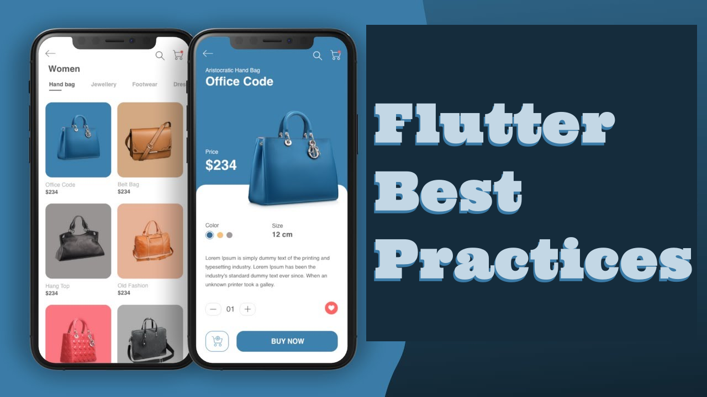

# Flutter Best Practices

A re-modding of the Flutter 2.5 Skeleton App Template into something that really equally shows flutter best practices in DevOPS, OOP, and UX.

Why? Because the end customers, App Users and Employers expect a mature full-grown developer and designer. This is designed to teach the best practices in flutter app dev and design without resorting to introducing all the bad habits and techniques.

## Flutter And Dart Resources

To get started with Flutter, you really should explore the [Dart Language Tour](https://dart.dev/guides/language/language-tour) first.

For help getting started with Flutter, view the [online documentation](https://flutter.dev/docs), which offers tutorials, samples, guidance on mobile development, and a full API reference.

## Flutter Articles

### Dev Set Up and DevOPS

[Missing Flutter Best Practices](https://medium.com/geekculture/missing-flutter-best-practices-72a1fa684d09)

### User Interfaces, UX, and Widgets

### OOP and FP and Application Architecture Patterns

### State Management
